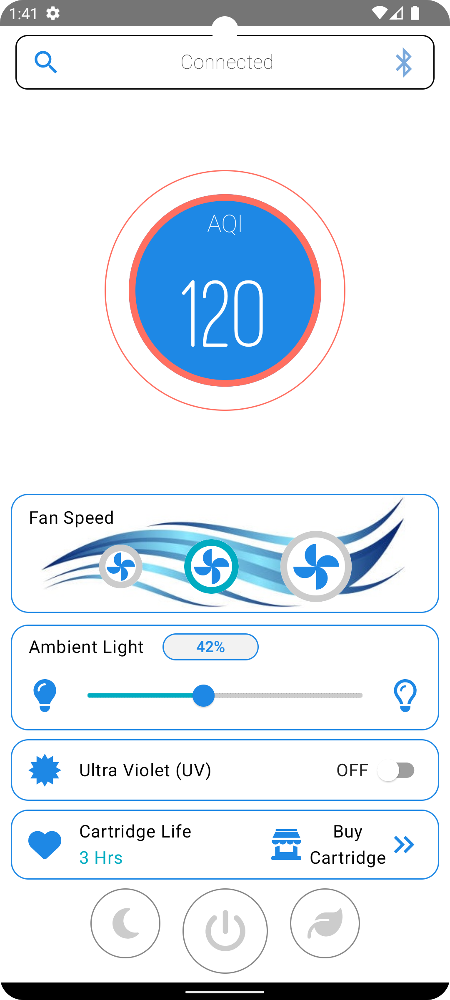

# Air Purifier App (Kotlin Multiplatform Mobile)

## Overview
This Air Purifier app delivers a seamless experience for both Android and iOS users. Built using Kotlin Multiplatform Mobile (KMM), it leverages the following technologies and tools:

- **BLE (Bluetooth Low Energy)**: For connecting and communicating with the air purifier device.
- **Koin**: Dependency injection framework for Android and iOS..
- **Ktor**: Networking library for Android and iOS.
- **MQTT**: Networking library to M2M communication for Android and iOS.
- **ViewModel**: For managing UI-related data for Android and iOS.
- **Room Database**: For local data storage for Android and iOS.
- **DataStore**: To store user preferences/settings for Android and iOS.
- **Flow**: For asynchronous data streams for Android and iOS.
- **Actual/Expect**: To handle platform-specific implementations in Kotlin.
- **Compose Multiplatform UI**: To share UI code across Android and iOS platforms.
- **Datetime API**: DB datetime code across Android and iOS platforms.
- **Custom Fonts**: Used custom fonts across Android and iOS platforms.
- **Napier-Logging Library**: Napier is a lightweight logging library for Kotlin Multiplatform (KMP) that works on Android, iOS, and other platforms. It's similar to Timber but designed for KMP.
- **Kotlin Test**: Unit Tests.

---

## Project Structure
This project targets both **Android** and **iOS** platforms. Below is the folder structure and its purpose:

### `/composeApp`
This folder contains the code shared across Compose Multiplatform applications. It has several subfolders:

- **`commonMain`**: Contains code common to all targets (e.g., business logic, shared UI components, utilities).
- **Platform-Specific Folders**: Contains Kotlin code specific to the target platform.
  - For example, platform-specific calls like Apple's `CoreCrypto` for iOS should be placed in `iosMain`.

### `/iosApp`
This folder contains the entry point for the iOS application. Even when sharing UI with Compose Multiplatform, this folder includes:
- iOS-specific configurations and setup.
- Swift/SwiftUI code if needed for the iOS project.

---

## Features
- **Air Quality Monitoring (AQI)**: Real-time AQI updates.
- **Fan Speed Control**: Adjust fan speed to optimize air purification.
- **Ambient Light Adjustment**: Customize the device's ambient light settings.
- **UV Toggle**: Control the Ultra Violet light feature.
- **Cartridge Life Tracking**: Monitor the cartridge usage and remaining life.
- **Cross-Platform UI**: A consistent and smooth interface across Android and iOS devices.

---

### Home Screen


---

## How to Run the Project

### Prerequisites
1. Install [Android Studio](https://developer.android.com/studio).
2. Install Xcode (for iOS development).
3. Install Kotlin Multiplatform Mobile plugin in Android Studio.

### Steps
1. Clone the repository:
   ```bash
   git clone <repository-url>
   ```

2. Open the project in Android Studio.

3. For **Android**:
  - Select the `androidApp` module and run the app.

4. For **iOS**:
  - Open the project in Xcode (`/iosApp` folder).
  - Select a simulator or connected device and build the project.

---

## Todo
  - Improve BLE code
  - Add Encryption in BLE communication
  - Develop API in kotlin ktor
  - Add Authentication in App (Backend + FrontEnd)
  - Unit Tests
  - Update all dependencies whenever new available

## Learn More
- [Kotlin Multiplatform Documentation](https://www.jetbrains.com/help/kotlin-multiplatform-dev/get-started.html)
- [Compose Multiplatform Overview](https://www.jetbrains.com/lp/compose-multiplatform/)
